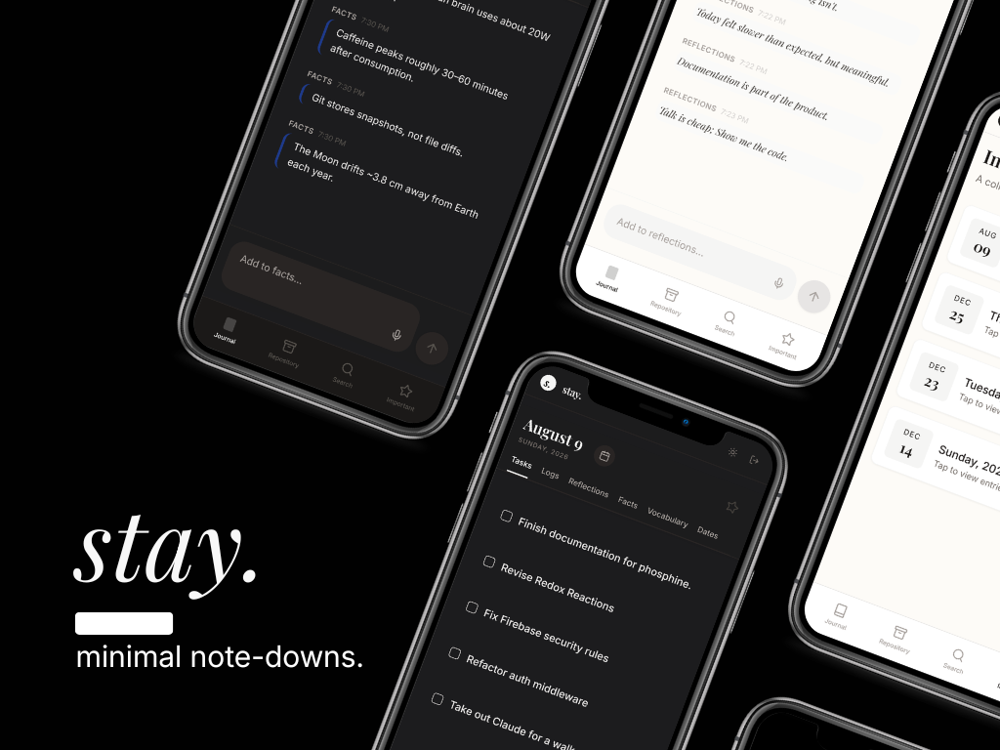
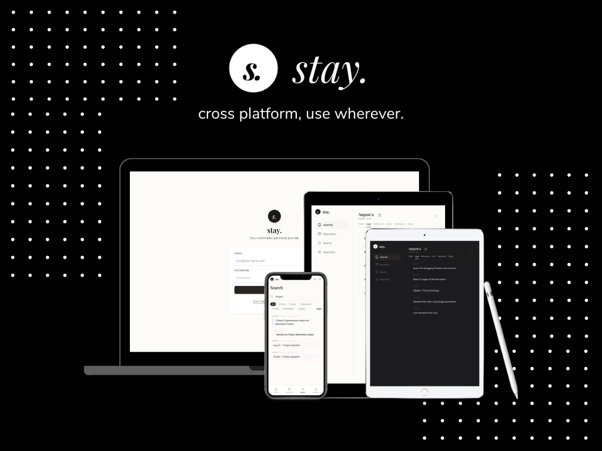

# stay

> _A personal memory jar._

stay is a small personal journaling application I built after realizing I didn't actually need another productivity system—I just needed somewhere to write things down.

{width=300px}

It's intentionally simple. No endless customization, no complicated knowledge graph, no "second brain". Just a clean interface where thoughts can stay until you need them again.

This project was heavily AI-assisted during development. I treated it less as a software engineering exercise and more as an experiment in quickly turning an idea into something usable, something I'd like and personally use. It's far from perfect, and that's okay.

---

## Why?

{width=300px}

I love applications like Obsidian, Notion and Logseq.
They're incredibly powerful.

But somewhere along the way I found myself spending more time organising thoughts than actually writing them.

Folders.
Tags.
Databases.
Templates.
Second brains.

_stay_ was my personal solution to get out of that.<br>
It isn't designed to replace knowledge management systems.<br>
It simply gives me somewhere to quickly write something down, revisit it later, and move on with my day.<br>
No productivity system.<br>
No graph view.<br>
No endless customization.<br>
Just a quiet place for thoughts. 

---

## Features

- Minimal, distraction-free interface
- Cross platform and portable.
- Firebase-backed authentication and storage
- Simple journaling workflow
- Responsive design
- Lightweight and easy to navigate
- Easy to reproduce from the developer's end.

The feature set is intentionally small. If a feature makes writing slower instead of easier, it probably doesn't belong here.

---

## Built With
- React
- Firebase Authentication
- Cloud Firestore
- Markdown

---

## Running Locally

```bash
git clone https://github.com/thearghyasarkar/stay.git

cd stay

npm install

npm run dev
```

You'll need your own Firebase project and configuration before the application can run. Tinker around the codebase if you want additional features added. The backend structure is kept stupidly simple. You could throw this in any of the agentic editors and expect them to add or change features for you.

---

## Status

_stay_ is something I actively use, and I'll probably continue making small improvements whenever I find something that gets in my way.
I'm not trying to turn it into a full productivity suite. I've Obsidian for that.

---

## Contributing

If you have ideas that fit the philosophy of the project, feel free to open an issue or submit a pull request.
If your idea makes the app significantly more complicated, propose it, but make sure you get the philosophy beforehand. :)

---

## License

MIT
